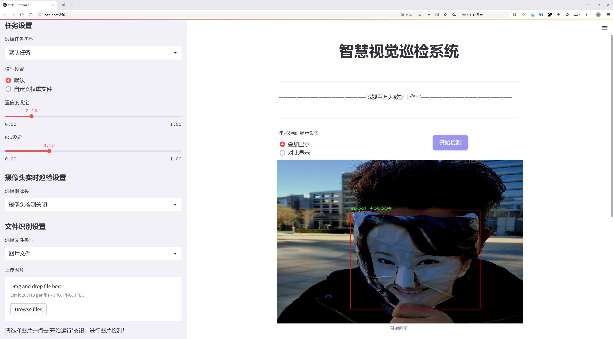

# 人脸活体检测检测系统源码分享
 # [一条龙教学YOLOV8标注好的数据集一键训练_70+全套改进创新点发刊_Web前端展示]

### 1.研究背景与意义

项目参考[AAAI Association for the Advancement of Artificial Intelligence](https://gitee.com/qunshansj/projects)

项目来源[AACV Association for the Advancement of Computer Vision](https://gitee.com/qunmasj/projects)

研究背景与意义

随着人工智能技术的迅猛发展，尤其是在计算机视觉领域的不断进步，人脸识别技术已广泛应用于安全监控、金融支付、身份验证等多个重要场景。然而，伴随这些应用的普及，面临的安全隐患也日益突出，尤其是针对人脸识别系统的攻击手段不断演变，其中最为常见的便是“活体检测”问题。活体检测旨在区分真实的人脸与伪造的图像或视频（如照片、视频播放等），以防止身份盗用和欺诈行为。因此，构建一个高效、准确的人脸活体检测系统显得尤为重要。

本研究旨在基于改进的YOLOv8模型，开发一个高效的人脸活体检测系统。YOLO（You Only Look Once）系列模型以其实时性和高精度而受到广泛关注，尤其是在目标检测任务中表现优异。YOLOv8作为该系列的最新版本，进一步优化了检测速度和准确性，适合于实时监控和快速响应的应用场景。然而，现有的YOLOv8模型在处理活体检测任务时，仍然存在一定的局限性，尤其是在伪造样本的识别上。因此，通过对YOLOv8进行改进，结合特定的活体检测数据集，可以显著提升系统的性能。

本研究所使用的数据集包含2100张图像，分为“live”和“spoof”两个类别，涵盖了真实人脸和伪造人脸的多种情况。这一数据集的构建为活体检测系统的训练和验证提供了丰富的样本基础，能够有效提升模型的泛化能力和鲁棒性。通过对数据集的深入分析与处理，我们将采用数据增强、迁移学习等技术，进一步提升模型在复杂环境下的检测能力。

研究的意义不仅在于技术层面的突破，更在于其广泛的应用前景。随着社会对安全性要求的提高，活体检测技术在金融、公共安全、智能家居等领域的需求日益增长。通过本研究开发的基于改进YOLOv8的人脸活体检测系统，可以有效提升人脸识别的安全性，降低伪造攻击的风险，进而推动相关行业的健康发展。此外，本研究还将为后续的研究提供新的思路和方法，推动活体检测技术的进一步发展。

综上所述，基于改进YOLOv8的人脸活体检测系统的研究不仅具有重要的理论价值，也具有显著的实际应用意义。通过对活体检测技术的深入探索，我们期望能够为提升人脸识别系统的安全性贡献一份力量，为构建更加安全的社会环境奠定基础。

### 2.图片演示




##### 注意：由于此博客编辑较早，上面“2.图片演示”和“3.视频演示”展示的系统图片或者视频可能为老版本，新版本在老版本的基础上升级如下：（实际效果以升级的新版本为准）

  （1）适配了YOLOV8的“目标检测”模型和“实例分割”模型，通过加载相应的权重（.pt）文件即可自适应加载模型。

  （2）支持“图片识别”、“视频识别”、“摄像头实时识别”三种识别模式。

  （3）支持“图片识别”、“视频识别”、“摄像头实时识别”三种识别结果保存导出，解决手动导出（容易卡顿出现爆内存）存在的问题，识别完自动保存结果并导出到tempDir中。

  （4）支持Web前端系统中的标题、背景图等自定义修改，后面提供修改教程。

  另外本项目提供训练的数据集和训练教程,暂不提供权重文件（best.pt）,需要您按照教程进行训练后实现图片演示和Web前端界面演示的效果。

### 3.视频演示

[3.1 视频演示](https://www.bilibili.com/video/BV1n8tpefEPC/)

### 4.数据集信息展示

##### 4.1 本项目数据集详细数据（类别数＆类别名）

nc: 2
names: ['live', 'spoof']


##### 4.2 本项目数据集信息介绍

数据集信息展示

在现代计算机视觉领域，人脸活体检测技术的进步对于安全性和用户体验至关重要。为此，我们引入了名为“liveness_cam”的数据集，该数据集专门用于训练和改进YOLOv8模型，以实现高效、准确的人脸活体检测。该数据集的设计旨在涵盖两种主要类别：活体（live）和伪造（spoof），通过这两种类别的对比，模型能够学习到有效的特征，以识别真实的人脸与各种伪造手段之间的差异。

“liveness_cam”数据集包含丰富的图像样本，这些样本经过精心挑选和标注，确保了数据的多样性和代表性。每个类别都包含大量的图像数据，涵盖了不同的光照条件、角度、表情以及背景。这种多样性不仅增强了模型的泛化能力，还提高了其在实际应用中的鲁棒性。活体类别的图像展示了真实用户的面部特征，强调了自然的面部表情和动态变化；而伪造类别则包括了各种欺骗手段的图像，如照片、视频播放以及面具等，模拟了可能的攻击场景。

在数据集的构建过程中，研究团队采用了先进的图像采集技术，确保每个样本的质量和清晰度。此外，为了进一步提升模型的学习效果，数据集还包括了不同年龄、性别和种族的样本，力求涵盖更广泛的人群特征。这种多样性不仅能够帮助模型学习到更全面的特征，还能减少因数据偏差导致的识别错误，从而提高活体检测的准确性。

在训练过程中，YOLOv8模型将利用“liveness_cam”数据集进行深度学习，通过反复迭代优化其参数，逐步提升对活体与伪造图像的识别能力。模型将通过特征提取、分类和定位等多个阶段，学习到如何在复杂的环境中准确区分活体与伪造图像。尤其是在面对伪造攻击时，模型的表现将直接影响到人脸识别系统的安全性和可靠性。

为了验证模型的有效性，研究团队还计划在“liveness_cam”数据集上进行严格的测试和评估，使用多种性能指标，如准确率、召回率和F1-score等，全面分析模型在不同场景下的表现。这些评估结果将为后续的研究和应用提供重要的参考依据。

总之，“liveness_cam”数据集不仅为YOLOv8模型的训练提供了坚实的基础，也为人脸活体检测技术的发展开辟了新的方向。通过不断优化和改进，我们期望该系统能够在实际应用中展现出卓越的性能，为用户提供更安全、更便捷的服务。


### 5.全套项目环境部署视频教程（零基础手把手教学）

[5.1 环境部署教程链接（零基础手把手教学）](https://www.ixigua.com/7404473917358506534?logTag=c807d0cbc21c0ef59de5)


[5.2 安装Python虚拟环境创建和依赖库安装视频教程链接（零基础手把手教学）](https://www.ixigua.com/7404474678003106304?logTag=1f1041108cd1f708b01a)

### 6.手把手YOLOV8训练视频教程（零基础小白有手就能学会）

[6.1 手把手YOLOV8训练视频教程（零基础小白有手就能学会）](https://www.ixigua.com/7404477157818401292?logTag=d31a2dfd1983c9668658)

### 7.70+种全套YOLOV8创新点代码加载调参视频教程（一键加载写好的改进模型的配置文件）

[7.1 70+种全套YOLOV8创新点代码加载调参视频教程（一键加载写好的改进模型的配置文件）](https://www.ixigua.com/7404478314661806627?logTag=29066f8288e3f4eea3a4)

### 8.70+种全套YOLOV8创新点原理讲解（非科班也可以轻松写刊发刊，V10版本正在科研待更新）

由于篇幅限制，每个创新点的具体原理讲解就不一一展开，具体见下列网址中的创新点对应子项目的技术原理博客网址【Blog】：


[8.1 70+种全套YOLOV8创新点原理讲解链接](https://gitee.com/qunmasj/good)

### 9.系统功能展示（检测对象为举例，实际内容以本项目数据集为准）

图9.1.系统支持检测结果表格显示

  图9.2.系统支持置信度和IOU阈值手动调节

  图9.3.系统支持自定义加载权重文件best.pt(需要你通过步骤5中训练获得)

  图9.4.系统支持摄像头实时识别

  图9.5.系统支持图片识别

  图9.6.系统支持视频识别

  图9.7.系统支持识别结果文件自动保存

  图9.8.系统支持Excel导出检测结果数据


### 10.原始YOLOV8算法原理

原始YOLOv8算法原理

YOLOv8是由Ultralytics公司于2023年推出的最新目标检测算法，作为YOLO系列的延续，YOLOv8在前几代算法的基础上进行了多项重要的改进和优化。本文将重点探讨YOLOv8n版本的核心原理及其创新之处。

YOLOv8n算法的设计理念在于实现轻量化和高效性，同时保持或提升检测精度。其网络结构主要由骨干特征提取网络、特征融合层和检测头层组成。与YOLOv5相比，YOLOv8n在骨干网络中采用了C2f模块来替代C3模块，这一变更不仅减小了模型的参数量，还提高了特征提取的效率。C2f模块通过引入ELAN（Efficient Layer Aggregation Network）思想，设计了两个分支以进行特征提取，其中一个分支直接将特征传递至Concat层，另一个分支则通过多个Bottleneck模块进行深度特征学习。这样的设计有效缓解了深层网络中的梯度消失问题，同时增强了浅层特征的重用能力，从而使得模型在不同深度的特征学习上都能保持良好的性能。

在特征融合层，YOLOv8n采用了PAN-FPN（Path Aggregation Network with Feature Pyramid Network）结构，这一结构通过多尺度特征的自下而上和自上而下的融合，确保了不同层次特征的有效结合。YOLOv8n在这一层的设计中，去除了YOLOv5中的1x1卷积层，直接将高层特征上采样后与中层特征进行连接，这样的设计使得特征融合更加高效，避免了因卷积操作带来的信息损失。

YOLOv8n在检测头的设计上也进行了创新，采用了Anchor-Free的检测方式，这一方式摒弃了传统的Anchor-Base方法，简化了目标检测的过程。通过解耦头结构，YOLOv8n将分类和回归任务分开处理，使得每个任务的学习更加专注和高效。具体而言，YOLOv8n的检测头通过三个不同尺度的特征图进行目标检测，这些特征图分别对应于80x80、40x40和20x20的分辨率，能够有效捕捉到不同大小目标的特征信息。

在损失函数的设计上，YOLOv8n采用了VFLLoss作为分类损失，并结合DFLLoss和CIoULoss来优化回归任务。这种损失函数的组合不仅提升了模型的收敛速度，还有效应对了样本不平衡的问题，尤其是在处理小目标时表现出色。Focal Loss的引入，进一步增强了模型对难以分类样本的关注，确保了在训练过程中，模型能够更好地学习到小目标的特征。

数据预处理方面，YOLOv8n延续了YOLOv5的策略，采用了马赛克增强、混合增强、空间扰动和颜色扰动等多种数据增强手段，以提升模型的泛化能力和鲁棒性。这些增强方法通过丰富训练样本的多样性，帮助模型在面对不同场景和光照条件时，依然能够保持较高的检测精度。

在整体架构上，YOLOv8n通过将输入图像转化为640x640的RGB图像，经过CBS（Convolution + Batch Normalization + SiLU）网络进行特征提取。CBS模块通过卷积操作提取目标的纹理和颜色特征，并利用归一化技术解决反向传播过程中的梯度消失和梯度爆炸问题，进而提升模型的收敛速度和效果。通过在网络中引入最大池化操作，YOLOv8n进一步增强了特征提取的能力，使得模型在深层次特征学习中，能够更好地融合局部特征和全局特征。

总的来说，YOLOv8n通过一系列创新的设计和优化，不仅在轻量化和高效性上取得了显著进展，还在目标检测的精度和速度上达到了新的高度。其在骨干网络、特征融合层和检测头的改进，使得YOLOv8n在处理复杂场景和多尺度目标时，展现出强大的适应能力和出色的性能。这些特性使得YOLOv8n成为当前目标检测领域的一个重要里程碑，为后续的研究和应用提供了坚实的基础。


### 11.项目核心源码讲解（再也不用担心看不懂代码逻辑）

#### 11.1 code\ultralytics\data\explorer\explorer.py

以下是经过精简和注释的核心代码部分，主要保留了`Explorer`类的关键功能和方法。

```python
# Ultralytics YOLO 🚀, AGPL-3.0 license

from pathlib import Path
from typing import Any, List, Union
import numpy as np
import torch
from ultralytics.data.dataset import YOLODataset
from ultralytics.models.yolo.model import YOLO
from ultralytics.utils import LOGGER
import lancedb

class ExplorerDataset(YOLODataset):
    def __init__(self, *args, data: dict = None, **kwargs) -> None:
        super().__init__(*args, data=data, **kwargs)

    def load_image(self, i: int) -> Union[Tuple[np.ndarray, Tuple[int, int], Tuple[int, int]], Tuple[None, None, None]]:
        """从数据集中加载一张图像，不进行任何缩放操作。"""
        im, f, fn = self.ims[i], self.im_files[i], self.npy_files[i]
        if im is None:  # 如果图像未缓存于内存
            if fn.exists():  # 如果存在.npy文件，加载它
                im = np.load(fn)
            else:  # 否则，读取图像文件
                im = cv2.imread(f)  # 读取为BGR格式
                if im is None:
                    raise FileNotFoundError(f"图像未找到 {f}")
            h0, w0 = im.shape[:2]  # 获取原始高度和宽度
            return im, (h0, w0), im.shape[:2]

        return self.ims[i], self.im_hw0[i], self.im_hw[i]

class Explorer:
    def __init__(self, data: Union[str, Path] = "coco128.yaml", model: str = "yolov8n.pt", uri: str = "~/ultralytics/explorer") -> None:
        """初始化Explorer类，连接到LanceDB并加载YOLO模型。"""
        self.connection = lancedb.connect(uri)  # 连接到LanceDB
        self.table_name = Path(data).name.lower() + "_" + model.lower()  # 生成表名
        self.model = YOLO(model)  # 加载YOLO模型
        self.data = data  # 数据集路径
        self.table = None  # 初始化表为None
        self.progress = 0  # 进度初始化

    def create_embeddings_table(self, force: bool = False, split: str = "train") -> None:
        """创建包含数据集中图像嵌入的LanceDB表。"""
        if self.table is not None and not force:
            LOGGER.info("表已存在，正在重用。使用force=True可以覆盖。")
            return
        if self.table_name in self.connection.table_names() and not force:
            LOGGER.info(f"表 {self.table_name} 已存在，正在重用。使用force=True可以覆盖。")
            self.table = self.connection.open_table(self.table_name)
            self.progress = 1
            return
        if self.data is None:
            raise ValueError("必须提供数据以创建嵌入表")

        # 检查数据集信息
        data_info = check_det_dataset(self.data)
        if split not in data_info:
            raise ValueError(f"数据集中未找到分割 {split}。可用的键为 {list(data_info.keys())}")

        choice_set = data_info[split]
        choice_set = choice_set if isinstance(choice_set, list) else [choice_set]
        dataset = ExplorerDataset(img_path=choice_set, data=data_info, augment=False, cache=False, task=self.model.task)

        # 创建表结构
        batch = dataset[0]
        vector_size = self.model.embed(batch["im_file"], verbose=False)[0].shape[0]
        table = self.connection.create_table(self.table_name, schema=get_table_schema(vector_size), mode="overwrite")
        table.add(self._yield_batches(dataset, data_info, self.model))

        self.table = table

    def _yield_batches(self, dataset: ExplorerDataset, data_info: dict, model: YOLO):
        """生成用于嵌入的数据批次。"""
        for i in range(len(dataset)):
            self.progress = float(i + 1) / len(dataset)
            batch = dataset[i]
            batch = sanitize_batch(batch, data_info)  # 清理批次数据
            batch["vector"] = model.embed(batch["im_file"], verbose=False)[0].detach().tolist()  # 生成嵌入向量
            yield [batch]

    def query(self, imgs: Union[str, np.ndarray, List[str], List[np.ndarray]] = None, limit: int = 25) -> Any:
        """查询表中相似的图像。"""
        if self.table is None:
            raise ValueError("表未创建，请先创建表。")
        if isinstance(imgs, str):
            imgs = [imgs]
        embeds = self.model.embed(imgs)
        embeds = torch.mean(torch.stack(embeds), 0).cpu().numpy() if len(embeds) > 1 else embeds[0].cpu().numpy()
        return self.table.search(embeds).limit(limit).to_arrow()  # 返回查询结果

    def sql_query(self, query: str, return_type: str = "pandas") -> Union[DataFrame, Any, None]:
        """在表上运行SQL查询。"""
        if self.table is None:
            raise ValueError("表未创建，请先创建表。")
        if not query.startswith("SELECT") and not query.startswith("WHERE"):
            raise ValueError(f"查询必须以SELECT或WHERE开头。找到 {query}")
        if query.startswith("WHERE"):
            query = f"SELECT * FROM 'table' {query}"
        LOGGER.info(f"运行查询: {query}")

        rs = duckdb.sql(query)
        return rs.df() if return_type == "pandas" else rs.arrow()

    def get_similar(self, img: Union[str, np.ndarray, List[str], List[np.ndarray]] = None, limit: int = 25) -> Union[DataFrame, Any]:
        """查询表中相似的图像，返回结果。"""
        img = self._check_imgs_or_idxs(img)
        similar = self.query(img, limit=limit)
        return similar.to_pandas()  # 返回结果为DataFrame

    def _check_imgs_or_idxs(self, img: Union[str, np.ndarray, List[str], List[np.ndarray], None]) -> List[np.ndarray]:
        """检查输入的图像或索引的有效性。"""
        if img is None:
            raise ValueError("必须提供图像或索引。")
        return img if isinstance(img, list) else [img]

# 其他方法如plot_sql_query、ask_ai等可以根据需要添加。
```

### 代码说明
1. **ExplorerDataset**: 继承自`YOLODataset`，用于加载图像并处理数据集。
   - `load_image`: 加载指定索引的图像，支持从缓存或文件系统读取。

2. **Explorer**: 主要类，负责与LanceDB交互，创建嵌入表和执行查询。
   - `__init__`: 初始化类，连接到数据库并加载YOLO模型。
   - `create_embeddings_table`: 创建包含图像嵌入的数据库表。
   - `_yield_batches`: 生成图像的嵌入向量批次。
   - `query`: 查询相似图像。
   - `sql_query`: 执行SQL查询。
   - `get_similar`: 获取相似图像并返回结果。

以上代码为核心功能，保留了主要的逻辑和结构，去掉了冗余部分，并添加了详细的中文注释以便理解。

这个文件是一个名为 `explorer.py` 的 Python 脚本，属于 Ultralytics YOLO 项目，主要用于图像数据集的探索和处理。它包含了两个主要的类：`ExplorerDataset` 和 `Explorer`，分别用于加载数据集和进行图像相似性查询等操作。

`ExplorerDataset` 类继承自 `YOLODataset`，用于加载图像数据。它的 `load_image` 方法根据索引从数据集中加载图像，支持从缓存或磁盘读取图像，并返回图像及其原始尺寸。`build_transforms` 方法用于创建图像转换操作，主要用于数据增强，但在这里并不涉及图像的缩放。

`Explorer` 类是主要的功能实现类，构造函数接受数据集路径、模型路径和数据库 URI。它首先检查所需的库是否已安装，然后连接到 LanceDB 数据库。类中有多个方法用于创建图像嵌入表、查询相似图像、执行 SQL 查询、绘制查询结果等。

`create_embeddings_table` 方法用于创建一个包含图像嵌入的数据库表。如果表已经存在，可以选择覆盖。它首先检查数据集的有效性，然后生成图像的嵌入向量并将其存储在数据库中。

`query` 方法允许用户查询相似图像，支持单个图像或图像列表的输入，并返回相似图像的结果。`sql_query` 方法则允许用户执行 SQL 风格的查询，支持返回 Pandas DataFrame 或 Arrow 表格格式的结果。

`plot_sql_query` 方法用于可视化 SQL 查询的结果，`get_similar` 和 `plot_similar` 方法则用于获取和绘制相似图像。`similarity_index` 方法计算所有图像的相似性索引，返回每个图像的相似图像及其距离信息。

此外，`ask_ai` 方法允许用户通过自然语言查询图像，AI 会生成相应的 SQL 查询并返回结果。`visualize` 和 `generate_report` 方法目前是占位符，尚未实现。

总体而言，这个文件提供了一套完整的工具，用于加载图像数据集、计算图像嵌入、查询相似图像以及可视化结果，适用于计算机视觉和深度学习相关的应用。

#### 11.2 code\ultralytics\trackers\__init__.py

以下是代码中最核心的部分，并附上详细的中文注释：

```python
# 导入所需的跟踪器类
from .bot_sort import BOTSORT  # 导入BOTSORT类，用于目标跟踪
from .byte_tracker import BYTETracker  # 导入BYTETracker类，用于另一种目标跟踪方法
from .track import register_tracker  # 导入注册跟踪器的函数

# 定义可供外部访问的模块成员
__all__ = "register_tracker", "BOTSORT", "BYTETracker"  # 允许更简单的导入方式，指定模块公开的接口
```

### 注释说明：
1. **导入部分**：
   - `from .bot_sort import BOTSORT`：从当前包中导入`BOTSORT`类，`BOTSORT`通常用于高效的目标跟踪。
   - `from .byte_tracker import BYTETracker`：从当前包中导入`BYTETracker`类，`BYTETracker`是另一种目标跟踪算法，适用于不同的应用场景。
   - `from .track import register_tracker`：从当前包中导入`register_tracker`函数，用于注册不同的跟踪器，以便在后续的代码中使用。

2. **`__all__`变量**：
   - `__all__`是一个特殊变量，用于定义当使用`from module import *`时，哪些名称会被导入。这里指定了`register_tracker`、`BOTSORT`和`BYTETracker`，使得这些类和函数可以被外部模块方便地访问。

这个程序文件是一个Python模块的初始化文件，位于`code/ultralytics/trackers/`目录下。文件的开头有一个注释，表明这个模块是与Ultralytics YOLO（一个流行的目标检测模型）相关的，并且遵循AGPL-3.0许可证。

接下来，文件导入了三个组件：`BOTSORT`、`BYTETracker`和`register_tracker`。这些组件分别来自于同一目录下的`bot_sort`、`byte_tracker`和`track`模块。`BOTSORT`和`BYTETracker`可能是不同的跟踪算法或类，而`register_tracker`则可能是一个用于注册跟踪器的函数。

最后，`__all__`变量被定义为一个包含字符串的元组，列出了该模块公开的接口。通过定义`__all__`，可以控制从这个模块中使用`from module import *`语句时，哪些名称会被导入。这里公开的名称包括`register_tracker`、`BOTSORT`和`BYTETracker`，这使得其他模块在导入时可以更简单地使用这些组件。

总体来说，这个文件的主要作用是组织和导出与目标跟踪相关的功能，使得其他模块能够方便地使用这些功能。

#### 11.3 ui.py

以下是代码中最核心的部分，并附上详细的中文注释：

```python
import sys
import subprocess

def run_script(script_path):
    """
    使用当前 Python 环境运行指定的脚本。

    Args:
        script_path (str): 要运行的脚本路径

    Returns:
        None
    """
    # 获取当前 Python 解释器的路径
    python_path = sys.executable

    # 构建运行命令，使用 streamlit 运行指定的脚本
    command = f'"{python_path}" -m streamlit run "{script_path}"'

    # 执行命令，并等待其完成
    result = subprocess.run(command, shell=True)
    
    # 检查命令执行的返回码，如果不为0，表示出错
    if result.returncode != 0:
        print("脚本运行出错。")

# 实例化并运行应用
if __name__ == "__main__":
    # 指定要运行的脚本路径
    script_path = "web.py"  # 这里可以替换为实际的脚本路径

    # 调用函数运行脚本
    run_script(script_path)
```

### 代码说明：
1. **导入模块**：
   - `sys`：用于访问与 Python 解释器相关的变量和函数。
   - `subprocess`：用于创建新进程、连接到它们的输入/输出/错误管道，并获得它们的返回码。

2. **`run_script` 函数**：
   - 接受一个参数 `script_path`，表示要运行的 Python 脚本的路径。
   - 使用 `sys.executable` 获取当前 Python 解释器的路径，以确保在正确的环境中运行脚本。
   - 构建命令字符串，使用 `streamlit` 模块运行指定的脚本。
   - 使用 `subprocess.run` 执行命令，并等待其完成。
   - 检查返回码，如果返回码不为0，表示脚本运行出错，打印错误信息。

3. **主程序**：
   - 使用 `if __name__ == "__main__":` 确保只有在直接运行该脚本时才会执行以下代码。
   - 指定要运行的脚本路径（在这里是 `web.py`）。
   - 调用 `run_script` 函数来运行指定的脚本。

这个程序文件的主要功能是使用当前的 Python 环境来运行一个指定的脚本，具体来说是一个名为 `web.py` 的脚本。文件的开头导入了必要的模块，包括 `sys`、`os` 和 `subprocess`，以及一个自定义的 `abs_path` 函数，用于获取文件的绝对路径。

在 `run_script` 函数中，首先获取当前 Python 解释器的路径，这样可以确保使用正确的 Python 环境来执行脚本。接着，构建一个命令字符串，该命令使用 `streamlit` 模块来运行指定的脚本。这里的 `streamlit` 是一个用于构建数据应用的流行库。

然后，使用 `subprocess.run` 方法来执行构建好的命令。这个方法会在一个新的 shell 中运行命令，并等待其完成。如果命令执行后返回的状态码不为零，表示脚本运行过程中出现了错误，程序会打印出“脚本运行出错”的提示。

在文件的最后部分，使用 `if __name__ == "__main__":` 语句来确保只有在直接运行该文件时才会执行下面的代码。这里指定了要运行的脚本路径 `web.py`，并调用 `run_script` 函数来执行它。

总体来说，这个程序的功能是简洁明了的，主要用于方便地运行一个 Streamlit 应用脚本，并处理可能出现的错误。

#### 11.4 70+种YOLOv8算法改进源码大全和调试加载训练教程（非必要）\ultralytics\models\yolo\pose\__init__.py

以下是代码中最核心的部分，并附上详细的中文注释：

```python
# 导入必要的模块
from .predict import PosePredictor  # 导入姿态预测器类
from .train import PoseTrainer      # 导入姿态训练器类
from .val import PoseValidator      # 导入姿态验证器类

# 定义模块的公开接口
__all__ = 'PoseTrainer', 'PoseValidator', 'PosePredictor'  # 指定从该模块导入时可用的类
```

### 详细注释：

1. **导入模块**：
   - `from .predict import PosePredictor`：从当前包的 `predict` 模块中导入 `PosePredictor` 类，该类负责进行姿态预测。
   - `from .train import PoseTrainer`：从当前包的 `train` 模块中导入 `PoseTrainer` 类，该类用于训练姿态模型。
   - `from .val import PoseValidator`：从当前包的 `val` 模块中导入 `PoseValidator` 类，该类用于验证姿态模型的性能。

2. **定义公开接口**：
   - `__all__` 是一个特殊变量，用于定义当使用 `from module import *` 语句时，哪些名称是可以被导入的。在这里，`PoseTrainer`、`PoseValidator` 和 `PosePredictor` 被指定为可公开的接口，意味着这些类可以被外部模块直接使用。

这个文件是Ultralytics YOLO项目中的一个初始化文件，位于YOLOv8算法的姿态估计模块中。文件的主要功能是导入该模块中用于姿态估计的主要类，并定义模块的公共接口。

首先，文件顶部的注释部分提到这是Ultralytics YOLO项目，并且使用的是AGPL-3.0许可证。这意味着该项目是开源的，用户可以自由使用和修改，但需要遵循相应的许可证条款。

接下来，文件通过相对导入的方式引入了三个重要的类：`PosePredictor`、`PoseTrainer`和`PoseValidator`。这些类分别负责姿态预测、模型训练和模型验证的功能。具体来说，`PosePredictor`用于执行姿态估计的预测任务，`PoseTrainer`用于训练姿态估计模型，而`PoseValidator`则用于验证模型的性能。

最后，`__all__`变量定义了模块的公共接口，列出了可以被外部导入的类。这意味着当其他模块使用`from .pose import *`语句时，只会导入`PoseTrainer`、`PoseValidator`和`PosePredictor`这三个类，而不会导入其他未列出的内容。这种做法有助于控制模块的命名空间，避免不必要的命名冲突，并使得模块的使用更加清晰。

总的来说，这个初始化文件为姿态估计模块提供了一个清晰的结构，使得其他部分能够方便地使用和调用相关的功能。

#### 11.5 train.py

以下是经过简化和注释的核心代码部分，主要关注于YOLO检测模型的训练过程：

```python
import random
import numpy as np
import torch.nn as nn
from ultralytics.data import build_dataloader, build_yolo_dataset
from ultralytics.engine.trainer import BaseTrainer
from ultralytics.models import yolo
from ultralytics.nn.tasks import DetectionModel
from ultralytics.utils import LOGGER, RANK
from ultralytics.utils.torch_utils import de_parallel, torch_distributed_zero_first

class DetectionTrainer(BaseTrainer):
    """
    扩展自BaseTrainer类，用于基于检测模型的训练。
    """

    def build_dataset(self, img_path, mode="train", batch=None):
        """
        构建YOLO数据集。

        参数:
            img_path (str): 包含图像的文件夹路径。
            mode (str): 模式，可以是'train'或'val'，用于自定义不同的增强。
            batch (int, optional): 批次大小，适用于'rect'模式。默认为None。
        """
        gs = max(int(de_parallel(self.model).stride.max() if self.model else 0), 32)
        return build_yolo_dataset(self.args, img_path, batch, self.data, mode=mode, rect=mode == "val", stride=gs)

    def get_dataloader(self, dataset_path, batch_size=16, rank=0, mode="train"):
        """构造并返回数据加载器。"""
        assert mode in ["train", "val"]
        with torch_distributed_zero_first(rank):  # 仅在DDP中初始化数据集*.cache一次
            dataset = self.build_dataset(dataset_path, mode, batch_size)
        shuffle = mode == "train"  # 训练模式下打乱数据
        workers = self.args.workers if mode == "train" else self.args.workers * 2
        return build_dataloader(dataset, batch_size, workers, shuffle, rank)  # 返回数据加载器

    def preprocess_batch(self, batch):
        """对图像批次进行预处理，包括缩放和转换为浮点数。"""
        batch["img"] = batch["img"].to(self.device, non_blocking=True).float() / 255  # 归一化图像
        if self.args.multi_scale:  # 如果启用多尺度
            imgs = batch["img"]
            sz = (
                random.randrange(self.args.imgsz * 0.5, self.args.imgsz * 1.5 + self.stride)
                // self.stride
                * self.stride
            )  # 随机选择图像大小
            sf = sz / max(imgs.shape[2:])  # 计算缩放因子
            if sf != 1:
                ns = [
                    math.ceil(x * sf / self.stride) * self.stride for x in imgs.shape[2:]
                ]  # 计算新的形状
                imgs = nn.functional.interpolate(imgs, size=ns, mode="bilinear", align_corners=False)  # 调整图像大小
            batch["img"] = imgs
        return batch

    def get_model(self, cfg=None, weights=None, verbose=True):
        """返回YOLO检测模型。"""
        model = DetectionModel(cfg, nc=self.data["nc"], verbose=verbose and RANK == -1)
        if weights:
            model.load(weights)  # 加载权重
        return model

    def plot_training_samples(self, batch, ni):
        """绘制带有注释的训练样本。"""
        plot_images(
            images=batch["img"],
            batch_idx=batch["batch_idx"],
            cls=batch["cls"].squeeze(-1),
            bboxes=batch["bboxes"],
            paths=batch["im_file"],
            fname=self.save_dir / f"train_batch{ni}.jpg",
            on_plot=self.on_plot,
        )
```

### 代码说明：
1. **DetectionTrainer类**：继承自`BaseTrainer`，用于实现YOLO模型的训练。
2. **build_dataset方法**：根据给定的图像路径和模式构建YOLO数据集，支持训练和验证模式。
3. **get_dataloader方法**：构造数据加载器，支持分布式训练，并根据模式设置是否打乱数据。
4. **preprocess_batch方法**：对输入的图像批次进行预处理，包括归一化和可能的缩放处理。
5. **get_model方法**：返回一个YOLO检测模型实例，并可选择加载预训练权重。
6. **plot_training_samples方法**：绘制训练样本及其注释，便于可视化训练过程。

以上是YOLO检测模型训练的核心部分，包含了数据集构建、数据加载、图像预处理和模型管理等关键功能。

这个程序文件 `train.py` 是一个用于训练目标检测模型的脚本，特别是基于 YOLO（You Only Look Once）架构的模型。它继承自 `BaseTrainer` 类，提供了一系列用于构建数据集、数据加载、模型设置和训练过程中的辅助功能。

首先，程序导入了一些必要的库和模块，包括数学运算、随机数生成、深度学习相关的 PyTorch 库，以及 Ultralytics 提供的特定模块，这些模块包括数据处理、模型构建和训练器等。

在 `DetectionTrainer` 类中，定义了多个方法来支持训练过程。`build_dataset` 方法用于构建 YOLO 数据集，接收图像路径、模式（训练或验证）和批次大小作为参数。它会根据模型的步幅（stride）来调整数据集的构建。

`get_dataloader` 方法用于创建数据加载器，确保在分布式训练时只初始化一次数据集。它会根据训练或验证模式来设置数据加载的参数，如是否打乱数据等。

`preprocess_batch` 方法负责对每个批次的图像进行预处理，包括将图像缩放到合适的大小并转换为浮点数格式。这个方法还支持多尺度训练，通过随机选择图像的大小来增强模型的鲁棒性。

`set_model_attributes` 方法用于设置模型的属性，包括类别数量和类别名称，这些信息是从数据集中提取的。

`get_model` 方法返回一个 YOLO 检测模型，并可以选择加载预训练的权重。`get_validator` 方法则返回一个用于模型验证的验证器。

在训练过程中，损失值的记录和展示也非常重要。`label_loss_items` 方法用于返回带有标签的损失字典，便于后续的监控和分析。`progress_string` 方法生成一个格式化的字符串，显示训练进度，包括当前的 epoch、GPU 内存使用情况、损失值、实例数量和图像大小等信息。

此外，程序还提供了一些可视化功能，例如 `plot_training_samples` 方法用于绘制训练样本及其标注，`plot_metrics` 方法用于从 CSV 文件中绘制训练指标，`plot_training_labels` 方法则创建一个带标签的训练图，以便于分析模型的学习效果。

总的来说，这个 `train.py` 文件提供了一个完整的框架，用于训练 YOLO 模型，涵盖了数据处理、模型构建、训练过程管理和结果可视化等多个方面。

#### 11.6 70+种YOLOv8算法改进源码大全和调试加载训练教程（非必要）\ultralytics\models\sam\modules\transformer.py

以下是经过简化并注释的核心代码部分，主要包括 `TwoWayTransformer`、`TwoWayAttentionBlock` 和 `Attention` 类。这些类实现了一个双向变换器模型，能够同时关注图像和查询点。

```python
import math
import torch
from torch import Tensor, nn

class TwoWayTransformer(nn.Module):
    """
    双向变换器模块，能够同时关注图像和查询点。
    """

    def __init__(self, depth: int, embedding_dim: int, num_heads: int, mlp_dim: int, activation: Type[nn.Module] = nn.ReLU) -> None:
        """
        初始化双向变换器。

        Args:
          depth (int): 变换器的层数
          embedding_dim (int): 输入嵌入的通道维度
          num_heads (int): 多头注意力的头数
          mlp_dim (int): MLP块的内部通道维度
        """
        super().__init__()
        self.depth = depth
        self.layers = nn.ModuleList()

        # 创建多个双向注意力块
        for i in range(depth):
            self.layers.append(TwoWayAttentionBlock(embedding_dim, num_heads, mlp_dim, activation))

    def forward(self, image_embedding: Tensor, point_embedding: Tensor) -> Tuple[Tensor, Tensor]:
        """
        前向传播函数。

        Args:
          image_embedding (torch.Tensor): 图像嵌入
          point_embedding (torch.Tensor): 查询点嵌入

        Returns:
          (torch.Tensor): 处理后的查询点嵌入
          (torch.Tensor): 处理后的图像嵌入
        """
        # 处理图像嵌入
        bs, c, h, w = image_embedding.shape
        image_embedding = image_embedding.flatten(2).permute(0, 2, 1)  # 转换形状为 B x (H*W) x C

        queries = point_embedding
        keys = image_embedding

        # 通过每个层进行处理
        for layer in self.layers:
            queries, keys = layer(queries, keys)

        return queries, keys


class TwoWayAttentionBlock(nn.Module):
    """
    双向注意力块，执行自注意力和交叉注意力。
    """

    def __init__(self, embedding_dim: int, num_heads: int, mlp_dim: int = 2048) -> None:
        """
        初始化双向注意力块。

        Args:
          embedding_dim (int): 嵌入的通道维度
          num_heads (int): 注意力头的数量
          mlp_dim (int): MLP块的隐藏维度
        """
        super().__init__()
        self.self_attn = Attention(embedding_dim, num_heads)  # 自注意力层
        self.cross_attn = Attention(embedding_dim, num_heads)  # 交叉注意力层
        self.mlp = nn.Sequential(
            nn.Linear(embedding_dim, mlp_dim),
            nn.ReLU(),
            nn.Linear(mlp_dim, embedding_dim)
        )

    def forward(self, queries: Tensor, keys: Tensor) -> Tuple[Tensor, Tensor]:
        """应用自注意力和交叉注意力并返回处理后的嵌入。"""

        # 自注意力
        attn_out = self.self_attn(queries, queries, queries)
        queries = queries + attn_out  # 残差连接

        # 交叉注意力
        attn_out = self.cross_attn(queries, keys, keys)
        queries = queries + attn_out  # 残差连接

        # MLP处理
        mlp_out = self.mlp(queries)
        queries = queries + mlp_out  # 残差连接

        return queries, keys


class Attention(nn.Module):
    """注意力层，允许在投影到查询、键和值后进行下采样。"""

    def __init__(self, embedding_dim: int, num_heads: int) -> None:
        """
        初始化注意力层。

        Args:
            embedding_dim (int): 输入嵌入的维度。
            num_heads (int): 注意力头的数量。
        """
        super().__init__()
        self.q_proj = nn.Linear(embedding_dim, embedding_dim)  # 查询投影
        self.k_proj = nn.Linear(embedding_dim, embedding_dim)  # 键投影
        self.v_proj = nn.Linear(embedding_dim, embedding_dim)  # 值投影
        self.out_proj = nn.Linear(embedding_dim, embedding_dim)  # 输出投影

    def forward(self, q: Tensor, k: Tensor, v: Tensor) -> Tensor:
        """计算给定查询、键和值的注意力输出。"""

        # 投影输入
        q = self.q_proj(q)
        k = self.k_proj(k)
        v = self.v_proj(v)

        # 计算注意力
        attn = torch.softmax(q @ k.transpose(-2, -1) / math.sqrt(k.size(-1)), dim=-1)  # 计算注意力权重
        out = attn @ v  # 计算输出
        return self.out_proj(out)  # 投影回原始维度
```

### 代码说明：
1. **TwoWayTransformer**: 这是双向变换器的核心类，负责构建多个注意力层并进行前向传播。
2. **TwoWayAttentionBlock**: 该类实现了自注意力和交叉注意力的逻辑，并包含一个MLP块用于进一步处理查询嵌入。
3. **Attention**: 这是一个注意力层的实现，负责计算注意力权重并生成输出。

通过这些核心组件，模型能够有效地处理图像和查询点之间的关系，适用于各种计算机视觉任务。

这个程序文件实现了一个名为 `TwoWayTransformer` 的双向变换器模块，主要用于图像处理任务，如目标检测、图像分割和点云处理。该模块通过同时关注图像和查询点，利用位置嵌入来增强模型的表现。

在 `TwoWayTransformer` 类中，构造函数接收多个参数，包括变换器的层数（`depth`）、输入嵌入的通道维度（`embedding_dim`）、多头注意力的头数（`num_heads`）、MLP块的内部通道维度（`mlp_dim`）以及激活函数等。构造函数内部会根据指定的层数创建多个 `TwoWayAttentionBlock` 层，并将它们存储在一个模块列表中。此外，还定义了一个最终的注意力层和一个层归一化层，用于处理查询和图像之间的关系。

在 `forward` 方法中，输入的图像嵌入和位置编码被展平并重新排列，以便适应后续的计算。该方法首先准备查询和键的输入，然后依次通过每个注意力层进行处理。最后，应用最终的注意力层，将处理后的查询和键返回。

`TwoWayAttentionBlock` 类实现了一个注意力块，能够执行自注意力和交叉注意力。该块包含四个主要层：对稀疏输入的自注意力、稀疏输入与密集输入的交叉注意力、对稀疏输入的MLP块以及密集输入与稀疏输入的交叉注意力。构造函数中初始化了各个层，并根据需要选择是否跳过第一层的位置信息。

在 `forward` 方法中，首先执行自注意力计算，然后进行稀疏输入与密集输入之间的交叉注意力，接着通过MLP块处理查询，最后再进行密集输入与稀疏输入之间的交叉注意力。每一步之后都进行了层归一化，以提高模型的稳定性和性能。

`Attention` 类则实现了一个基本的注意力机制，支持在投影到查询、键和值之后进行下采样。构造函数中定义了输入嵌入的维度、注意力头的数量以及下采样率。该类包含了输入的投影层，并提供了将输入分离成多个注意力头和重新组合的静态方法。

在 `forward` 方法中，首先对输入的查询、键和值进行投影，然后将它们分离成多个头，计算注意力分数，并通过softmax函数归一化。最后，将注意力输出重新组合并通过输出投影层返回。

整体而言，这个文件实现了一个复杂的双向变换器架构，利用多头注意力机制和MLP块来处理图像和查询点之间的关系，适用于多种计算机视觉任务。

### 12.系统整体结构（节选）

### 整体功能和构架概括

该项目是一个基于Ultralytics YOLO架构的计算机视觉工具集，主要用于目标检测、姿态估计和图像处理等任务。整体架构包括多个模块，涵盖数据处理、模型训练、推理、可视化和评估等功能。每个模块都承担特定的任务，通过相互协作来实现完整的工作流程。

- **数据处理模块**：负责加载和预处理数据集，进行数据增强和转换。
- **模型模块**：实现不同的YOLO模型和变换器，支持目标检测和姿态估计。
- **训练模块**：提供训练模型的功能，包括数据加载、损失计算和模型评估。
- **推理模块**：实现模型的推理功能，能够对新数据进行预测。
- **可视化模块**：提供结果的可视化功能，帮助用户理解模型的性能和结果。

### 文件功能整理表

| 文件路径                                                                                     | 功能描述                                                                                      |
|----------------------------------------------------------------------------------------------|-----------------------------------------------------------------------------------------------|
| `code/ultralytics/data/explorer/explorer.py`                                                | 提供数据集探索和相似图像查询的功能，支持图像嵌入和数据库操作。                              |
| `code/ultralytics/trackers/__init__.py`                                                    | 初始化目标跟踪模块，导入不同的跟踪算法（如BOTSORT和BYTETracker）。                          |
| `ui.py`                                                                                     | 用于运行Streamlit应用的脚本，简化了图形用户界面的启动过程。                                |
| `70+种YOLOv8算法改进源码大全和调试加载训练教程（非必要）/ultralytics/models/yolo/pose/__init__.py` | 初始化姿态估计模块，导入相关的类（如PosePredictor、PoseTrainer、PoseValidator）。          |
| `train.py`                                                                                  | 提供训练YOLO模型的功能，包括数据集构建、模型设置和训练过程管理。                          |
| `70+种YOLOv8算法改进源码大全和调试加载训练教程（非必要）/ultralytics/models/sam/modules/transformer.py` | 实现双向变换器模块，支持图像和查询点之间的关系处理，适用于多种视觉任务。                    |
| `70+种YOLOv8算法改进源码大全和调试加载训练教程（非必要）/ultralytics/nn/modules/__init__.py` | 初始化神经网络模块，导入相关的网络结构和功能。                                             |
| `code/ultralytics/models/rtdetr/val.py`                                                    | 实现RT-DETR模型的验证功能，评估模型在验证集上的性能。                                      |
| `predict.py`                                                                                | 提供模型推理功能，能够对输入数据进行预测并输出结果。                                        |
| `code/ultralytics/models/sam/predict.py`                                                   | 实现SAM（Segment Anything Model）模型的推理功能，支持图像分割任务。                        |
| `70+种YOLOv8算法改进源码大全和调试加载训练教程（非必要）/ultralytics/data/augment.py`         | 提供数据增强功能，支持多种图像增强技术以提高模型的鲁棒性。                                 |
| `code/ultralytics/utils/benchmarks.py`                                                    | 提供基准测试功能，用于评估模型的性能和效率。                                                |

以上表格总结了各个文件的主要功能，帮助理解整个项目的结构和各个模块之间的关系。

注意：由于此博客编辑较早，上面“11.项目核心源码讲解（再也不用担心看不懂代码逻辑）”中部分代码可能会优化升级，仅供参考学习，完整“训练源码”、“Web前端界面”和“70+种创新点源码”以“13.完整训练+Web前端界面+70+种创新点源码、数据集获取”的内容为准。

### 13.完整训练+Web前端界面+70+种创新点源码、数据集获取


# [下载链接：https://mbd.pub/o/bread/ZpuXk5hx](https://mbd.pub/o/bread/ZpuXk5hx)